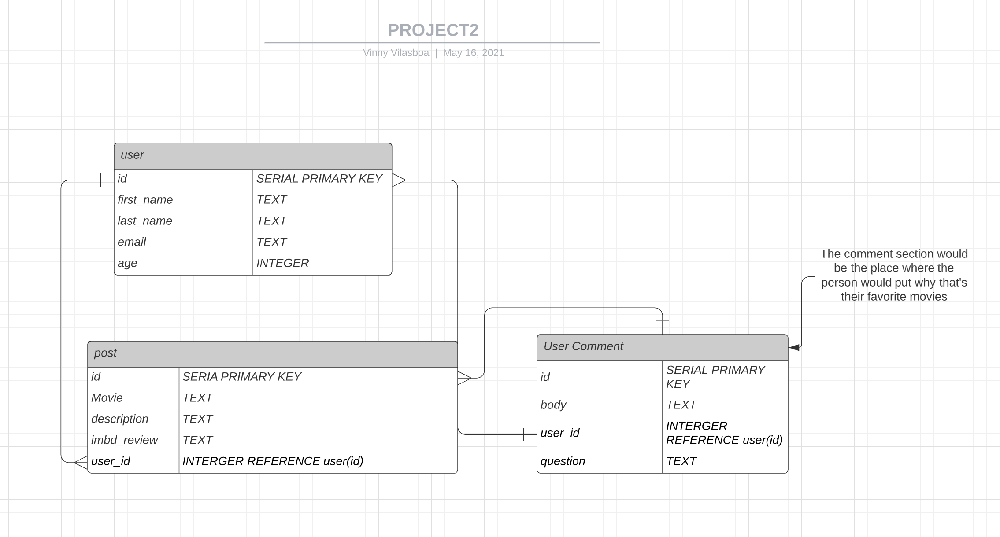

# Proposal
Requirements for the weekend
`1` An application name / concept 

POWER LIST 
A list where people can add their top 5 favorite movies for other people to get inspired when they don't know what to watch!

- [x]

`2` A repo for your project 2 (built from express_auth template)

- [x]

`3` Wireframe for your app - (Lucidchart)

CLICK [HERE](https://lucid.app/lucidchart/invitations/accept/inv_dadd07cb-661c-486b-b8c4-e272bc0d5908?viewport_loc=-525%2C-8%2C2798%2C1300%2C0_0) TO COMMENT ON THE WIREFRAME FOR INDEX

- [X]

`4` An ERD with two models (minimum) > User + 1 Resource (one to many) - (Lucidchart)

USER
AGE 
EMAIL

MOVIES
GENRE
IMDB RATING? 

Not sure if i did these right. 

- [X]

`5` Create (3-5) User Stories for the base user experience - ( [Reference](https://revelry.co/resources/development/user-stories-that-dont-suck/) )

1. As a movie buff, i want a platform people can go to look at people's top 5 movies to get inspired and/or try something out of their comfort zone

2. As a movie enthusiast, i want a place where people can post their categorized top 5 movies so other people can comment on what they thought 

3. Instead of scrolling mindlessly through netflix/prime i would love to look at my friends top 5 movies to see what they like and have more to talk about later.

4. Instead of looking for a movie for hours, my friends can show me what their top 5 favorite movies of all time is at POWER LIST.

- [X]

`6` Resource's Restful Routing table ( [Readme](https://romebell.gitbook.io/sei-412/node-express/00readme-1/01intro-to-express/00readme#restful-routing) )

- []

`7` Find API and test to see if you can get data ( *be able to print data in the console using Axios, Node-Fetch, and/or Postman* )

** I got the API key from OMD to use movie reviews and ref -- a bit confused on what to do next but i'm gonna look into it. 
- [x]